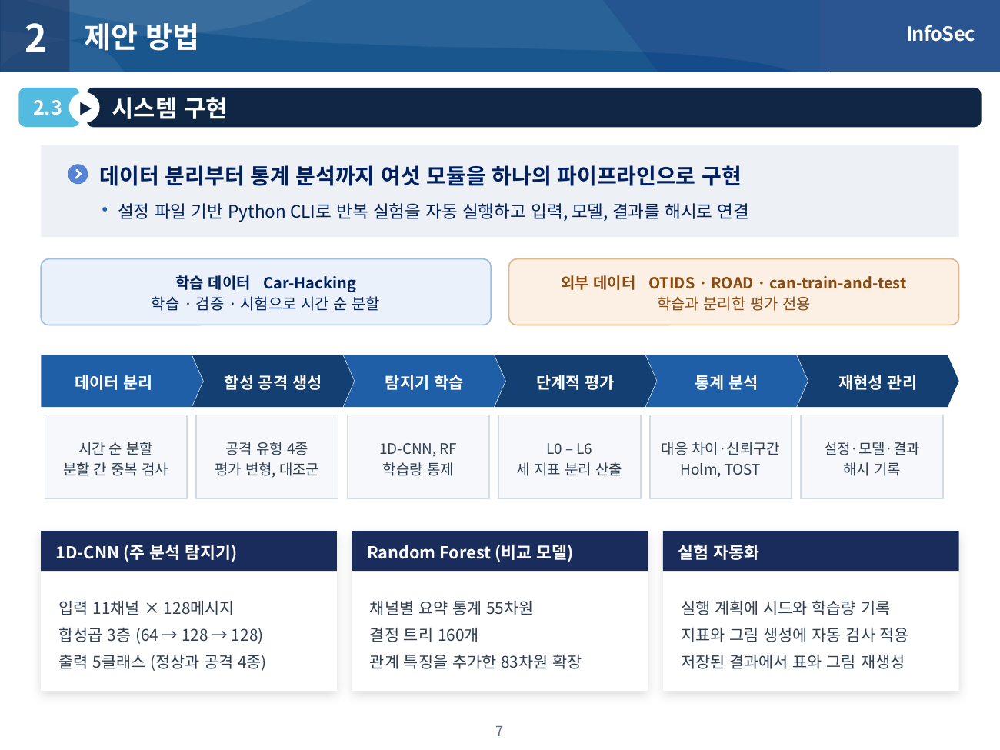
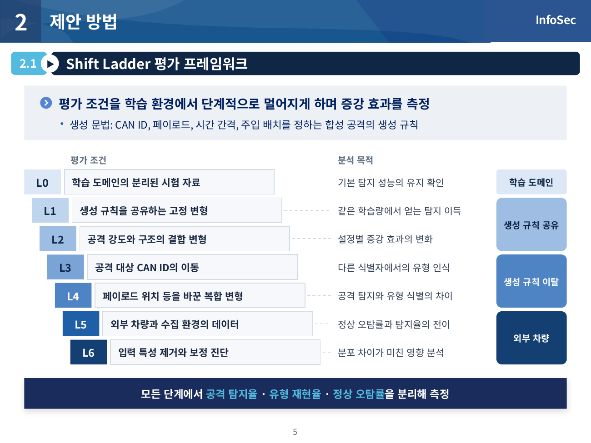
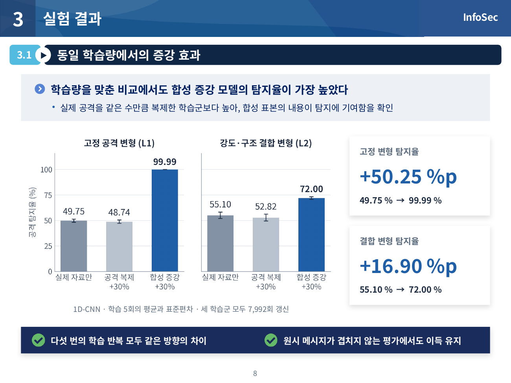
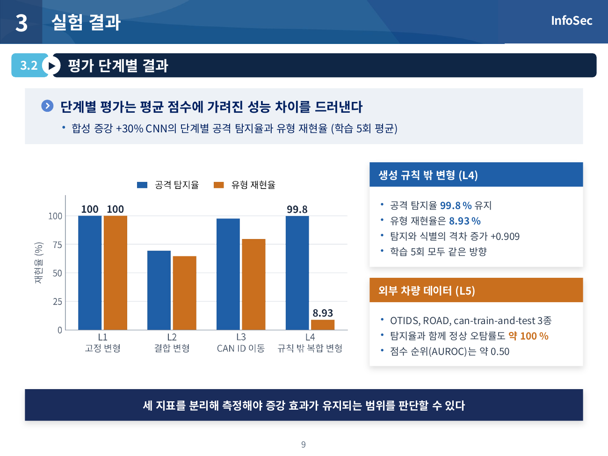
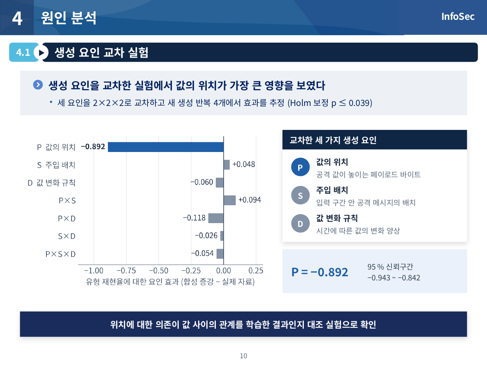
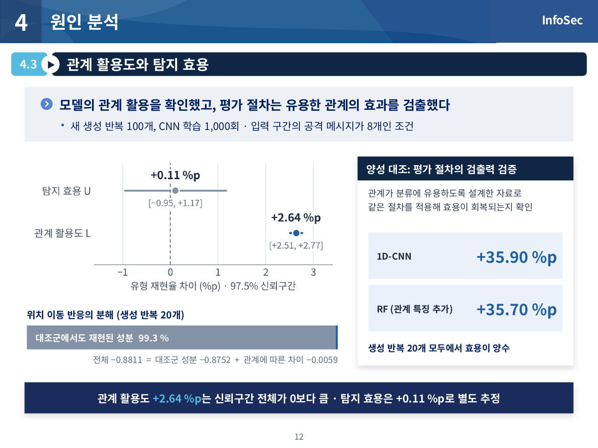

# 합성 CAN 공격 데이터 증강의 신뢰성 검증을 위한 단계적 평가 프레임워크 설계 및 구현

2026 전기 부산대학교 정보컴퓨터공학부 졸업과제 46조 **InfoSec** · 지도교수 김호원

차량 내부 통신망(CAN) 침입탐지 모델에 규칙 기반 합성 공격 데이터를 추가했을 때
탐지 성능이 **왜, 어디까지** 좋아지는지를 단계적으로 검증하는 평가 프레임워크
**Shift Ladder**를 설계하고 구현하였다. 데이터 분리, 합성 공격 생성, 탐지기 학습,
L0–L6 단계 평가, 통계 분석과 재현성 관리를 하나의 파이프라인으로 통합하였다.

| 자료 | 파일 |
|---|---|
| 착수보고서 | [PDF](docs/01.보고서/2026전기_착수보고서_46_InfoSec_합성_CAN_공격_데이터_증강의_신뢰성_검증을_위한_단계적_평가_프레임워크_설계_및_구현.pdf) |
| 중간보고서 | [PDF](docs/01.보고서/2026중간보고서_46_InfoSec_합성_CAN_공격_데이터_증강의_신뢰성_검증을_위한_단계적_평가_프레임워크_설계_및_구현.pdf) |
| 최종보고서 | [PDF](docs/01.보고서/2026전기_최종보고서_46_InfoSec_합성_CAN_공격_데이터_증강의_신뢰성_검증을_위한_단계적_평가_프레임워크_설계_및_구현.pdf) |
| 포스터 | [PDF](docs/02.포스터/2026포스터_46_InfoSec.pdf) |
| 발표자료 | [PDF](docs/03.발표자료/2026전기_발표자료_46_InfoSec.pdf) · [PPTX](docs/03.발표자료/2026전기_발표자료_46_InfoSec.pptx) |

---

## 1. 프로젝트 배경

### 1.1. 국내외 시장 현황 및 문제점

차량의 엔진, 변속기, 제동 장치 등은 전자제어장치(ECU)가 CAN 메시지를 주고받으며
동작한다. CAN 프로토콜은 송신자 인증 기능을 기본 제공하지 않으므로, 통신망에 접근한
공격자는 정상 식별자를 재사용해 메시지를 주입·재생하거나 대량 전송으로 통신을 방해할
수 있다[1]. 이를 막기 위해 메시지의 식별자, 데이터 값, 길이, 시간 간격을 분석하는
침입탐지시스템(IDS)이 연구되고 있다[2, 3].

지도학습 기반 CAN IDS는 공개 데이터셋에서 높은 성능을 보이지만 다음 문제가 있다[4].

- **공격 데이터 부족**: 실제 차량에서 다양한 공격을 반복 수집하기 어렵고, 공개 데이터셋의 공격 종류도 제한적이다.
- **분포 차이**: 차량·수집 장비·공격 구현이 바뀌면 CAN ID 구성, 페이로드 값, 메시지 간격이 달라진다.
- **증강 효과의 과대평가 위험**: GAN 등으로 공격 데이터를 합성해 보충하는 연구가 이어지고 있으나[5, 6],
  생성 자료와 평가 자료가 같은 규칙을 공유하면 탐지기가 특정 바이트 위치나 값 분포 같은 지름길에
  의존할 수 있다[7, 8]. 증강 전후 점수 비교만으로는 성능 향상의 원인과 유지 범위를 알 수 없다.

### 1.2. 필요성과 기대효과

증강 효과를 제대로 판단하려면 다음 세 가지를 구분해야 한다.

1. 표본 수·학습 횟수 증가의 효과와 **합성 표본 내용**의 효과
2. 공격의 존재를 맞히는 **탐지 성능**과 공격 유형을 맞히는 **식별 성능**
3. 새로운 차량에서의 **공격 탐지율**과 정상 통신에 대한 **오탐률**

본 과제는 이 구분을 평가 절차로 구현하였다. 이를 통해 합성 데이터 생성기를 개발하거나
도입할 때 성능 향상이 실제로 어디서 오는지, 어떤 조건에서 무너지는지를 사전에 점검할 수 있다.

---

## 2. 개발 목표

### 2.1. 목표 및 세부 내용

합성 증강의 탐지 효과와 생성 요소의 기여를 함께 평가하는 시스템을 구현한다.
이를 네 연구질문으로 구체화하였다.

| 연구질문 | 내용 |
|---|---|
| RQ1 | 합성 증강의 탐지 이득은 같은 표본 수·같은 학습량의 대조와 비중첩 평가에서도 유지되는가? |
| RQ2 | 이득은 공격 강도, 공격 계열, 대상 CAN ID, 생성 문법의 변화에 따라 어떻게 달라지는가? |
| RQ3 | 학습 도메인에서 정한 판정 기준과 점수 순위는 외부 차량 데이터에서도 개선되는가? |
| RQ4 | 생성된 Gear/RPM 관계의 활용도, 탐지 효용, 페이로드 위치 이동 반응은 맞춤 대조군과 비교해 어떻게 구분되는가? |

세부 기능 요구조건은 다음과 같다.

| ID | 요구조건 | 구현 내용 |
|---|---|---|
| FR-01 | 데이터 역할 분리 | 학습·검증·시험 자료를 먼저 분할하고 원본 행 중복 검사, 외부 데이터는 평가 전용 |
| FR-02 | 학습 자료 기반 생성 | 생성기와 표준화에 실제 학습 자료만 사용, 생성 조건·표준화 통계 기록 |
| FR-03 | 비교군 구성 | 실제 자료 학습, 실제 공격 복제, Rule 증강을 동일 7,992회 갱신 조건에서 비교 |
| FR-04 | 반복 학습 | 다섯 학습 반복의 학습·선택 이력 저장, 반복별 대응 차이 산출 |
| FR-05 | 단계적 평가 | L0–L6 조건별 평가와 결과 표·그림 생성 |
| FR-06 | 지표 분리 | 공격 탐지율, 유형 재현율, macro-F1, 정상 오탐률을 각각 산출 |
| FR-07 | 외부 평가 분리 | 외부 레이블은 성능 측정에만 사용, 학습·모델 선택에서 제외 |
| FR-08 | 관계 효과 분석 | 맞춤 대조군과 Rule의 반응 차이 및 동등성 구간 계산 |
| FR-09 | 근거 추적 | 입력 데이터, 선택 모델, 반복별 측정값을 연결하여 본문 수치 확인 |

### 2.2. 기존 서비스 대비 차별성

| 구분 | 기존 증강 연구 | 본 과제 |
|---|---|---|
| 비교 방식 | 증강 전후 시험 점수 비교 | 실제 공격 복제·동일 학습량 대조·원시 메시지 비중첩 평가로 합성 내용의 효과만 분리 |
| 평가 조건 | 학습과 같은 분포의 시험 자료 | L0–L6 단계로 공격 변형, CAN ID 이동, 생성 문법 이탈, 외부 차량까지 확장 |
| 지표 | 정확도·F1 중심 | 공격 탐지와 유형 식별을 분리하고 외부 오탐률·점수 순위(AUROC/AP)를 함께 보고 |
| 원인 분석 | 없음 | 요인 교차 실험과 맞춤 대조군(placebo)으로 위치·값 분포·관계 구조의 기여를 분해 |
| 검증 절차 | 단일 실험 | 100개 새 생성 반복 재현과 합성 양성 대조로 평가 절차 자체의 검출 능력 확인 |

### 2.3. 사회적 가치 도입 계획

- **안전한 차량 보안 기술 검증**: 합성 데이터로 부풀려진 IDS 성능을 걸러낼 수 있는 점검 절차를 제공하여,
  실제 차량에 적용되기 전에 탐지기의 한계를 드러낸다.
- **공개성과 재현성**: 공개 데이터셋만 사용하고, 설정·난수 초기값·결과표를 함께 공개하여 누구나 같은 절차를 재현할 수 있다.
- **데이터 수집 비용 절감**: 합성 데이터를 어떤 조건에서 신뢰할 수 있는지 알려주므로, 실제 공격 데이터를 추가로
  수집해야 할 조건을 좁혀 불필요한 수집 비용을 줄일 수 있다.

---

## 3. 시스템 설계

### 3.1. 시스템 구성도

시스템은 **데이터 분리 → 합성 공격 생성 → 탐지기 학습 → 단계적 평가 → 통계 분석 → 재현성 관리**의
여섯 모듈로 구성된다. 생성기는 실제 학습 자료만 사용하고, 검증 자료는 모델 선택과 판정 기준 설정에 사용한다.
내부 시험 자료와 외부 데이터는 평가 전용으로 분리한다.



Shift Ladder는 평가 조건을 학습 환경에서 단계적으로 멀어지게 하며 증강 효과를 측정한다.



| 단계 | 평가 조건 | 분석 목적 |
|---|---|---|
| L0 | 학습 도메인의 분리된 시험 자료 | 기본 탐지 성능과 증강 후 성능 유지 확인 |
| L1 | 생성 규칙을 공유하는 고정 변형 | 같은 학습량에서 합성 표본이 추가한 탐지 범위 측정 |
| L2 | 공격 강도·구조의 결합 변형 | 공격 계열과 설정별 증강 효과의 변화 분석 |
| L3 | 공격 대상 CAN ID 이동 | 학습한 식별자와 다른 식별자에서 유형 인식 평가 |
| L4 | 페이로드 위치 등을 바꾼 복합 변형 | 공격 탐지와 유형 식별의 차이 및 요인별 반응 분석 |
| L5 | 외부 차량·수집 데이터 | 정상 오탐률과 공격 탐지율을 함께 고려한 전이 평가 |
| L6 | 특성 제거와 보정 진단 | 분포 차이와 입력 특성이 결과에 미친 영향 분석 |

### 3.2. 사용 기술

| 구분 | 기술 |
|---|---|
| 언어·실행 | Python 3.12.3, 명령행 스크립트(설정 파일 기반) |
| 딥러닝 | PyTorch 2.12.0 (CUDA 13.0) — 1D-CNN(주 탐지기), BiLSTM(비교) |
| 머신러닝 | scikit-learn 1.9.0 — Random Forest(비교 탐지기) |
| 데이터 처리 | NumPy 2.4.6, pandas 3.0.3, PyArrow, SciPy 1.17.1 |
| 통계 | 대응 차이·신뢰구간, Holm 보정, 동등성 검정(TOST) |
| 시각화 | matplotlib 3.10.9 |
| 테스트 | pytest 9.0.3 |
| 실행 환경 | Linux, NVIDIA GB10 GPU |
| 데이터셋 | Car-Hacking(학습), OTIDS·ROAD·can-train-and-test(외부 평가 전용) [9–12] |

---

## 4. 개발 결과

### 4.1. 전체 시스템 흐름도

```text
 공개 원본 로그 (Car-Hacking / OTIDS / ROAD / can-train-and-test)
        │  전처리: 공통 11채널 표현 (CAN ID, DLC, 페이로드 8바이트, 시간 간격)
        ▼
 시간 순서 분할 (학습 60 / 검증 20 / 시험 20, 공격 구간 사이 1초 간격) ── 원본 행 중복 검사
        │  128개 메시지 윈도 (이동 간격 32)
        ├──────────────► 규칙 기반 생성기 (DoS·Fuzzy·Gear·RPM) ── 맞춤 대조군(placebo) 쌍
        ▼                          │
 탐지기 학습 (1D-CNN / RF / BiLSTM) ◄┘  학습군: 실제 자료 · 실제 공격 복제 · Rule 증강
        │  동일 갱신 횟수, 5개 학습 반복, 검증 macro-F1로 모델 선택
        ▼
 Shift Ladder 평가 (L0–L4 내부 변형 → L5 외부 데이터 → L6 특성 제거·보정 진단)
        │
        ▼
 통계 분석 (대응 차이, 신뢰구간, Holm, TOST) → 결과표·그림 + 입력 파일 해시 기록
```

### 4.2. 기능 설명 및 주요 기능 명세서

| 모듈 | 입력 | 출력과 자동 검사 | 주요 코드 |
|---|---|---|---|
| 전처리·분할 | 공개 데이터셋 원본 로그 | 공통 11채널 표현, 시간 순서 분할, 128-프레임 윈도 배열; 분할 간 원본 행 중복 검사 | `wisa/scripts/preprocess_datasets.py`, `split_datasets.py`, `generate_windows.py` |
| 합성 생성 | 학습용 정상 윈도, 생성 설정, 생성 시드 | 계열별 합성 묶음과 레이블, 평가용 변형(L1–L4), 맞춤 대조군 쌍; 값 개수·관계 조건 검사 | `wisa/scripts/generate_*.py`, `journal/scripts/generate_rule_based_synthetic_v2.py`, `generate_e16_rule_placebo_pairs.py` |
| 탐지기 학습 | 학습군 구성, 학습 시드, 갱신 횟수 | 선택 모델, 학습 이력, 검증 점수; 학습군 간 동일 행 선택 검사 | `wisa/scripts/train_*.py`, `wisa_camera_ready/scripts/run_matched_update_v1.py`, `journal/scripts/train_generator_extension_cnn.py` |
| 단계별 평가 | 선택 모델, 평가 윈도 | L0–L4 예측 건수, 정상 오탐률·공격 탐지율·유형 재현율 | `wisa/scripts/evaluate_*.py`, `wisa_camera_ready/scripts/evaluate_overlap_unit_v1.py` |
| 외부 평가·진단 | 선택 모델, 외부 데이터 | 고정 판정 기준의 운영점, AUROC/AP, 저-FPR TPR, ID 제거·보정 진단(L5–L6) | `wisa/scripts/evaluate_road_external.py`, `wisa_camera_ready/scripts/evaluate_external_ranking_v1.py` |
| 요인·관계 분석 | 반복별 결과표 | 요인 교차 효과, placebo 대비 위치 반응, 관계 활용도·효용 | `journal/scripts/*l4_counterfactual_factorial*.py`, `*rule_construction_seed_crossing*.py`, `*e16_relational_response*.py` |
| 통계·그림 | 반복별 결과표 | 대응 차이, 신뢰구간, Holm 보정, TOST; 표·그림과 입력 파일 해시 기록 | `journal/scripts/stats_*.py`, `make_*_figure.py` |

탐지기 명세는 다음과 같다.

| 구성 | 명세 |
|---|---|
| 입력 | 11채널 × 128메시지 (CAN ID, DLC, 페이로드 8바이트, 메시지 간 시간 간격) |
| 출력 | 정상·DoS·Fuzzy·Gear·RPM 다섯 클래스 점수 |
| 1D-CNN | 합성곱 3층(11→64→128→128, 커널 5·5·3) + 배치 정규화·ReLU, 최대/적응형 평균 풀링, 드롭아웃 0.2 |
| CNN 학습 | 클래스 가중 교차엔트로피, AdamW(학습률 1e-3, 가중치 감쇠 1e-4), 배치 512 |
| Random Forest | 채널별 평균·표준편차·최솟값·최댓값·끝–첫 값 차이 55차원 특징, 트리 160개, `balanced_subsample` |
| 모델 선택 | 학습 도메인 검증 자료의 macro-F1 최고 모델 |

#### 주요 결과

**① 동일 학습량에서의 증강 효과 (RQ1)** — 같은 7,992회 학습 갱신 조건에서 Rule +30% 모델의 고정 변형 탐지율은
49.75% → 99.99%(+50.25%p), 결합 변형 탐지율은 55.10% → 72.00%(+16.90%p)로 향상되었다.
두 차이는 다섯 학습 반복 모두에서 양수였고 원시 메시지 비중첩 평가에서도 유지되었다.



**② 평가 단계별 결과 (RQ2, RQ3)** — 생성 규칙을 벗어난 복합 변형(L4)에서 공격 탐지율은 99.8%였지만
유형 재현율은 8.93%로 떨어졌다. 외부 데이터(L5)에서는 Rule +30% CNN의 정상 오탐률이 거의 100%에 도달했고
점수 순위(AUROC)는 약 0.5로 개선되지 않았다.



**③ 생성 요인과 관계 분석 (RQ4)** — 요인 교차 실험에서 페이로드 **값의 위치**가 가장 큰 영향을 보였고,
위치 이동 반응의 대부분(99.3%)이 맞춤 대조군에서도 재현되었다. 100개 새 생성 반복과 1,000회 CNN 학습에서
관계 활용도는 +2.64%p(97.5% 신뢰구간 [+2.51, +2.77]), 탐지 효용은 +0.11%p(구간 0 포함)였다.
유용한 관계를 갖도록 설계한 합성 양성 대조에서는 CNN과 관계 특징 RF가 각각 35.90%p, 35.70%p의 효용을 회복하여,
평가 절차가 실제 효용을 검출할 수 있음을 확인하였다.




| 연구질문·가설 | 핵심 결과 | 판정 |
|---|---|---|
| RQ1·H1 | 공격 복제·동일 학습량 대조와 비중첩 평가에서도 고정·결합 변형의 탐지 이득 유지 | H1 지지 |
| RQ2·H2 | 공격 강도·유형별 차이는 있었으나 L2의 증강 효과가 일관되게 감소하지 않음 | 미지지 |
| RQ2·H3 | L4–L1의 탐지·유형 식별 격차 증가 평균 0.9088, 95% 구간 [0.7705, 1.0472] | H3 지지 |
| RQ3·H4 | 세 외부 데이터에서 오탐률·탐지율의 공동 개선과 점수 순위 개선이 나타나지 않음 | 미지지 |
| RQ4·H5 | 위치 반응 차이 −0.0059가 사전 동등성 한계 안; 새 생성 반복의 관계 활용도 +2.64%p | 위치 가설 미지지, 관계 활용 확인 |

#### 학술 성과

- Shift Ladder 평가 체계와 연구 결과를 정리한 논문 *The Shift Ladder: Locating the Gains and Failures of
  Rule-Based Synthetic CAN Attack Augmentation*이 **WISA 2026** Paper 세션에 채택되어 Oral 세션에서 발표하였다[13].

### 4.3. 디렉토리 구조

연구 단계별로 코드를 나누었다. 스크립트가 서로의 상대 경로를 참조하므로 폴더 이름은 원래 연구 환경과 같게 유지하였다.

```text
capstone-2026-team-46/
├── README.md
├── requirements.txt            상위 의존성
├── requirements.lock.txt       실행에 사용한 정확한 버전
├── datasets/
│   └── DOWNLOAD.md             공개 데이터셋 4종의 출처·체크섬·배치 경로 (데이터는 재배포하지 않음)
├── docs/
│   ├── 01.보고서/              착수·중간·최종보고서
│   ├── 02.포스터/              최종 발표 포스터
│   ├── 03.발표자료/            발표 PDF·PPTX
│   └── images/                 README 그림
├── wisa/                       1단계: Shift Ladder 기본 파이프라인 (WISA 2026 논문 공개 코드)
│   ├── config.yaml             분할 정책, 윈도 128/이동 32 등 공통 설정
│   ├── scripts/                전처리·분할·윈도·생성·학습·L0–L6 평가·진단 스크립트 51개
│   └── results/                논문 수치의 원본 결과표와 생성 규칙 명세
├── wisa_camera_ready/          2단계: 동일 학습량·비중첩·외부 점수 순위 보강 실험
│   ├── scripts/                run_matched_update_v1.py, evaluate_overlap_unit_v1.py, evaluate_external_ranking_v1.py
│   ├── experiments/            실험 계획(PLAN)·결과(RESULTS)·반복별 학습 이력
│   └── results/tables/         결과표
└── journal/                    3단계: 요인 교차·맞춤 대조군·관계 활용도 확장 검증
    ├── config.yaml
    ├── scripts/                최종보고서 실험(E13–E19, 양성 대조, 100회 재현)의 스크립트 64개
    ├── tests/                  단위·무결성 테스트
    ├── experiments/            실험별 사전 계획(PREREG), 실행·검사 기록
    ├── results/tables/         보고서 수치의 근거 결과표
    └── assets/fonts/           그림용 글꼴 (SIL OFL)
```

최종보고서의 실험과 코드의 대응은 다음과 같다.

| 보고서 실험 | 코드 위치 |
|---|---|
| L0–L6 기본 평가, 외부 데이터, ID 제거·보정 진단 | `wisa/scripts/` |
| 동일 학습량 대조(7,992회 갱신), 비중첩 평가, 외부 점수 순위 | `wisa_camera_ready/scripts/` |
| L1–L4 기본 실험·외부 운영점 (E13) | `journal/scripts/build_e13_sampling_v2_analysis.py`, `external_operating_point_neural.py` |
| 요인 교차 (E14, E15) | `journal/scripts/*l4_counterfactual_factorial*.py`, `*rule_construction_seed_crossing*.py` |
| 맞춤 대조군 (E16), RF·관계 특징 RF·BiLSTM 비교 (E17–E19) | `journal/scripts/*e16*`, `*e17*`, `*e18*`, `*e19*` |
| 합성 양성 대조 | `journal/scripts/run_attribution_positive_control_v1.py` |
| 100개 새 생성 반복 재현 | `journal/scripts/run_attribution_local_replication_v1.py`, `evaluate_attribution_local_replication_v2.py` |

---

## 5. 설치 및 실행 방법

### 5.1. 설치절차 및 실행 방법

**1) 환경 구성** (Linux, Python 3.12, NVIDIA GPU 권장 — CPU도 가능하지만 느림)

```bash
git clone https://github.com/pnucse-capstone2026/capstone-2026-team-46.git
cd capstone-2026-team-46
python3 -m venv .venv
source .venv/bin/activate
pip install torch --index-url https://download.pytorch.org/whl/cu130   # GPU 환경에 맞게 선택
pip install -r requirements.lock.txt
```

**2) 데이터셋 배치** — 네 데이터셋은 재배포하지 않는다. [datasets/DOWNLOAD.md](datasets/DOWNLOAD.md)의 출처에서 받아
`datasets/` 아래에 둔다. `wisa/datasets`와 `journal/datasets`는 이 폴더를 가리키는 심볼릭 링크다.

```text
datasets/9) Car-Hacking Dataset.zip       학습·검증·내부 시험·합성 생성
datasets/10) CAN-Intrusion Dataset.zip    OTIDS, 외부 평가 전용
datasets/can-train-and-test.zip           외부 평가 전용
datasets/road.zip                         외부 평가 전용
```

**3) 1단계: Shift Ladder 기본 파이프라인** — 단계별 전체 명령은 [wisa/README.md](wisa/README.md)에 있다.

```bash
cd wisa
python scripts/preprocess_datasets.py && python scripts/validate_preprocessing.py
python scripts/split_datasets.py          # 공격 구간 기준 시간 순서 분할 (60/20/20)
python scripts/generate_windows.py        # 128-프레임 윈도, 이동 간격 32
python scripts/generate_rule_based_synthetic.py
python scripts/generate_variant_test.py   # L1 고정 변형 (이어서 sensitivity, target-ID, out-of-generator 변형 생성)
python scripts/train_real_only_baselines.py
python scripts/train_rule_synthetic_ratio_sweep.py
python scripts/evaluate_variant_baselines.py
cd ..
```

**4) 2단계: 동일 학습량·비중첩·외부 점수 순위** (1단계의 윈도와 모델이 필요)

```bash
python wisa_camera_ready/scripts/run_matched_update_v1.py preflight
python wisa_camera_ready/scripts/run_matched_update_v1.py all        # 3개 학습군 × 5개 시드 학습·평가
python wisa_camera_ready/scripts/evaluate_overlap_unit_v1.py evaluate
python wisa_camera_ready/scripts/evaluate_external_ranking_v1.py
```

**5) 3단계: 확장 검증** — 각 실험은 사전 계획서의 순서(동결 → 생성 → 학습 → 채점 → 분석)대로 실행한다.
실험별 순서와 게이트는 `journal/experiments/<실험>/PREREG.md`의 *Mandatory execution order*에 있고,
각 스크립트의 옵션은 `--help`로 확인한다. 예: E16 맞춤 대조군 실험

```bash
python journal/scripts/generate_e16_rule_placebo_pairs.py --help
python journal/scripts/run_e16_paired_training.py --execute
python journal/scripts/evaluate_e16_relational_response.py --execute
python journal/scripts/analyze_e16_relational_response.py --execute
```

**6) 테스트** (데이터 없이 실행 가능)

```bash
pytest journal/tests
```

### 5.2. 오류 발생 시 해결 방법

| 증상 | 원인과 해결 |
|---|---|
| `FileNotFoundError: datasets/...zip` | 데이터셋을 `datasets/`에 두지 않았거나 파일 이름이 다르다. `DOWNLOAD.md`의 이름 그대로 둔다. Windows에서는 심볼릭 링크가 파일로 받아지므로 `wisa/datasets`, `journal/datasets`를 `datasets/`로 직접 연결하거나 복사한다. |
| 2·3단계에서 모델·윈도 파일이 없다는 오류 | 이전 단계 산출물(윈도 배열, 합성 묶음, 학습 모델)을 입력으로 쓴다. 1단계부터 순서대로 실행한다. 학습 모델 가중치는 저장소에 포함하지 않았다. |
| 학습 스크립트가 커밋되지 않은 코드라며 중단 | 실험 기록의 재현성을 위해 코드가 git에 커밋된 상태에서만 본 실행을 허용한다. 수정 후 커밋하고 다시 실행한다. |
| `test_l4_counterfactual_factorial.py`의 계보 검사 1건 실패 | 원래 연구 저장소의 커밋 이력과 코드 전이를 대조하는 테스트여서, 이력이 없는 이 저장소에서는 통과하지 않는다. 나머지 테스트에는 영향이 없다. |
| `test_e16_relational_response.py`에서 `fixture 'train_x' not found` | pytest용이 아니라 데이터를 불러 실행하는 점검 스크립트다. 데이터를 배치한 뒤 `python journal/tests/test_e16_relational_response.py`로 실행한다. |
| CUDA 메모리 부족 | 다른 GPU 작업을 종료한다. 학습 설정의 배치 크기(512)를 줄이면 기록된 결과와 달라질 수 있다. |

`experiments/`의 실행 기록(JSON)에는 원래 연구 환경의 절대 경로와 커밋 해시가 남아 있다.
이는 보고서 수치의 출처를 추적하기 위한 기록이며, 다시 실행하면 새 기록이 만들어진다.

---

## 6. 소개 자료

### 6.1. 프로젝트 소개 자료

- 발표자료: [PDF](docs/03.발표자료/2026전기_발표자료_46_InfoSec.pdf) · [PPTX](docs/03.발표자료/2026전기_발표자료_46_InfoSec.pptx)
- 포스터: [PDF](docs/02.포스터/2026포스터_46_InfoSec.pdf)
- 최종보고서: [PDF](docs/01.보고서/2026전기_최종보고서_46_InfoSec_합성_CAN_공격_데이터_증강의_신뢰성_검증을_위한_단계적_평가_프레임워크_설계_및_구현.pdf)

---

## 7. 팀 구성

### 7.1. 팀원별 소개 및 역할 분담

| 이름 | 소속 | 역할 |
|---|---|---|
| 장현진 ([@flyho77](https://github.com/flyho77)) | 정보컴퓨터공학부 인공지능전공 | 1인 과제 — 연구 설계, 데이터 처리·합성 공격 생성기·탐지기 구현, Shift Ladder 평가 및 확장 실험, 통계 분석, 보고서·발표 자료 작성 |

### 7.2. 팀원 별 참여 후기

**장현진** — 처음에는 합성 데이터를 추가하면 성능이 오르는지만 확인하려 했지만, 점수가 오른 이유를 설명하는
일이 훨씬 어려웠다. 표본 수와 학습 횟수가 늘어난 효과를 떼어 내기 위해 실제 공격 복제군과 동일 갱신 횟수 대조를
만들었고, 입력 구간이 겹치는 문제는 원시 메시지 비중첩 평가로 확인했다. 가장 어려웠던 부분은 모델이 생성 규칙의
어떤 요소에 반응하는지를 가려내는 일이었다. 값 분포는 그대로 두고 관계만 바꾼 맞춤 대조군을 설계하면서 대조군을
정의하는 방식에 따라 결론이 달라질 수 있다는 점을 배웠다. 실험 전에 비교 조건과 판정 기준을 먼저 고정하고, 결과가
가설과 다르게 나와도 그대로 기록하는 습관이 연구의 신뢰도를 지키는 데 가장 중요했다.

---

## 8. 참고 문헌 및 출처

1. K. Koscher et al., "Experimental security analysis of a modern automobile," *IEEE Symposium on Security and Privacy*, pp. 447–462, 2010.
2. H. M. Song, H. R. Kim, H. K. Kim, "Intrusion detection system based on the analysis of time intervals of CAN messages for in-vehicle network," *ICOIN*, pp. 63–68, 2016.
3. M. Hanselmann, T. Strauss, K. Dormann, H. Ulmer, "CANet: An unsupervised intrusion detection system for high dimensional CAN bus data," *IEEE Access*, 8:58194–58205, 2020.
4. S. Rajapaksha et al., "AI-based intrusion detection systems for in-vehicle networks: A survey," *ACM Computing Surveys*, 55(11):237, 2023.
5. E. Seo, H. M. Song, H. K. Kim, "GIDS: GAN-based intrusion detection system for in-vehicle network," *PST*, pp. 1–6, 2018.
6. Q. Zhao et al., "CAN bus intrusion detection based on auxiliary classifier GAN and out-of-distribution detection," *ACM TECS*, 21(4):1–30, 2022.
7. R. Geirhos et al., "Shortcut learning in deep neural networks," *Nature Machine Intelligence*, 2:665–673, 2020.
8. D. Arp et al., "Dos and don'ts of machine learning in computer security," *USENIX Security Symposium*, pp. 3971–3988, 2022.
9. Hacking and Countermeasure Research Lab, Car-Hacking Dataset, https://ocslab.hksecurity.net/Datasets/car-hacking-dataset
10. Hacking and Countermeasure Research Lab, CAN-Intrusion Dataset (OTIDS), https://ocslab.hksecurity.net/Dataset/CAN-intrusion-dataset
11. M. E. Verma et al., "A comprehensive guide to CAN IDS data and introduction of the ROAD dataset," *PLOS ONE*, 19(1):e0296879, 2024.
12. B. Lampe, W. Meng, "can-train-and-test: A curated CAN dataset for automotive intrusion detection," *Computers & Security*, 140:103777, 2024.
13. H. Jang, D. Shin, U. Ha, T.-T.-H. Le, H. Kim, "The Shift Ladder: Locating the gains and failures of rule-based synthetic CAN attack augmentation," *WISA 2026*.
14. L. Breiman, "Random forests," *Machine Learning*, 45(1):5–32, 2001.
15. D. Lakens, A. M. Scheel, P. M. Isager, "Equivalence testing for psychological research: A tutorial," *AMPPS*, 1(2):259–269, 2018.
